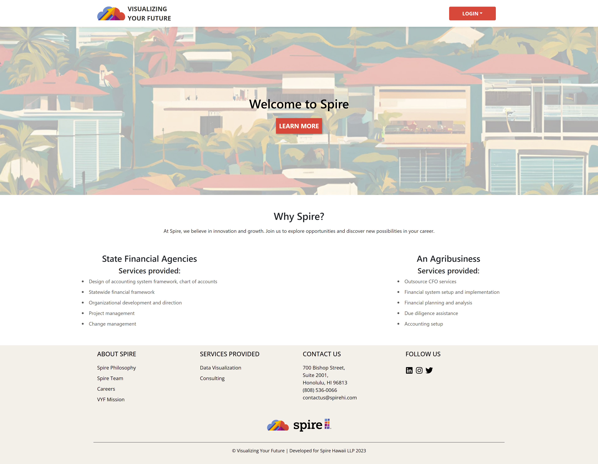

We started the semester being split into assigned teams and given the premise of the project objectives. This was different from many of my other experiences with group projects, where we’d often select our team members or at least give our input on who we wanted to work with. Though I hadn’t expected this, I think the opportunity to collaborate with peers we haven’t worked with before was a very valuable real-world experience. The goal of the semester was to create a web application for Spire Hawaii, a local accounting and advisory services firm, that would allow their users to visualize financial projections based on their data input — hence the name of our project group “Visualizing Your Future.” 

For the next 16 weeks, we utilized GitHub’s project management software, including milestone project boards where tasks (like developing features of the site or reviewing the standing code) could be assigned, tracked, and managed. I found that code reviews, while seemingly mundane or pesky, were extremely helpful in cleaning and clarifying our work. In the future, I can see myself returning to the IDPM review process and checklists to ensure that my code is effectively written. It was also important to have many people review the code using the same checklists so that repeated points of improvement could be highlighted, while less obvious or important suggestions could still be brought up with so many eyes on the project.  

There were a lot of ways that this course expanded my knowledge and view of software engineering. In comparison to my first project experience, in ICS 314, having all teams work on the same project was very interesting because we were able to see the different approaches and style choices each team made. Milestone presentations, especially those with the Spire Hawaii clients in attendance, really emphasized the importance of having effective demonstrations that showed the progress we made, allowed the clients to share their feedback, and enabled all of us to communicate the direction that we should be taking the project in.  

Throughout the project, we were able to use the tools we were introduced to ICS 314, like the Meteor framework and React library, to build even more complex applications with greater capabilities. We were given a lot of freedom in how we implemented the clients’ vision and how we worked with our team members. Overall, I think that this course gave me a lot of insight into what real-world project development looks like outside of the classroom, and I’m grateful for the experience. 

