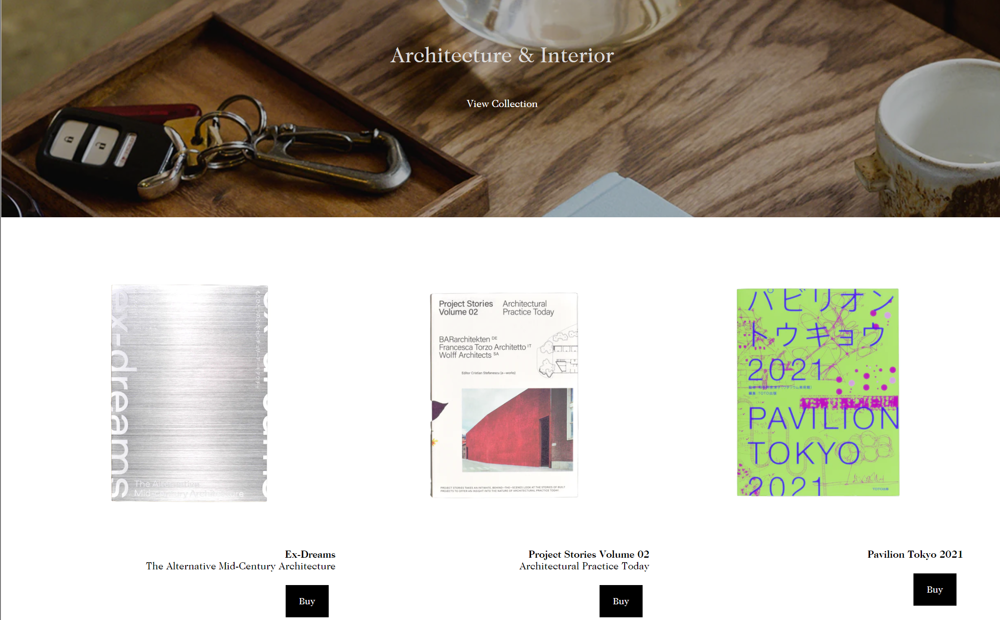
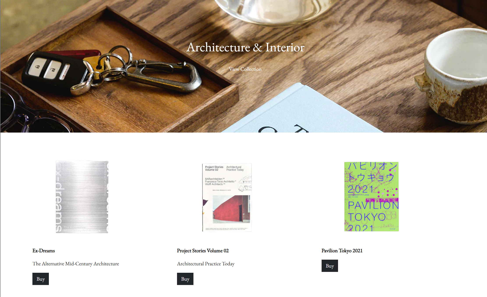
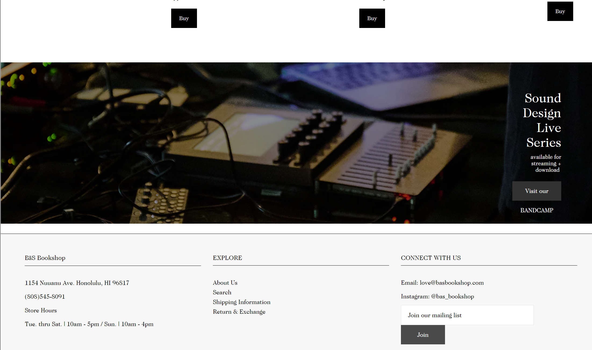

Though they can take some time to familiarize yourself with, user interface (UI) frameworks can be the missing key to improve your website building experience. But just like any other tool, you need to understand when and where to use it. 

## Think of it as an upgrade
In my experience with Bootstrap, frameworks are essentially a handful of shortcuts that can be used to expedite the site building process. You can think of coding with pure HTML and CSS as typing out an essay on a typewriter. In that sense, UI frameworks are like typing on a computer, with the ability to backspace, copy and paste, or add a sentence in the middle of an already written paragraph. You can write and turn in the same essay with either device, but one simply accelerates the writing experience. 

It does not necessarily mean that UI frameworks are the better choice for every single project. If your site does not require or benefit from the pre-built components, implementing a UI framework might just end up wasting your time or complicating a simple task. 

That being said, for a beginner with limited patience, HTML and CSS can be quite frustrating to work with on their own. Especially when you realize that the small hassles of getting your elements into a simple layout can really pile up. And while some may feel it necessary to write and customize every line of code, I am more than happy to use the help of some pre-built components and build off of them to get the job done. 

## Frameworks in action
After my first few class assignments of recreating retail and restaurant websites, I began to recognize how common and reused the website layouts were. In my opinion, that’s not a bad thing at all.  There’s no need to reinvent the wheel. For one of my assignments, I chose to study and recreate the [BaS Bookshop website](https://basbookshop.com/). Using Bootstrap's pre-built components, like navigation bars, buttons, and icons allowed me to worry less about how I was going to create each element and focus more on getting those elements were I wanted them to be. And I saw that by utilizing a simple and universally understood layout, it was easier to get a sense of each company from their branding and content rather than their fancy web designs.  

Though it can be easy to get lost in the “divs” and “classes” of it all, I think that UI frameworks are an extremely useful tool for beginning web developers to make effective websites. I think that the best way to figure out why certain elements work the way they do, is not by just reading the documentation, but really taking time to inspect any examples of these UI frameworks in action and finding ways to incorporate them into your own projects. 

*Screenshots of original website, followed by recreation.*

 
 
 

 
