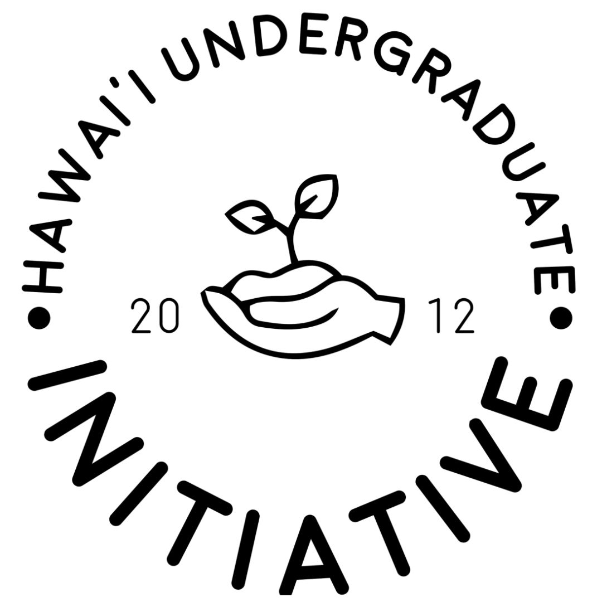

The Hawai'i Undergraduate Initiative (HUI) is a program under UH Manoa's Office of Multicultural Student Services which works to assist incoming UH Manoa freshmen with their transition to college life -- especially first generation students who may not be able to recieve guidance from their families. HUI provides free a free 3-credit summer college course to give students a head start on their college experience, along with resource workshops, social activities, and peer mentor support.  

I first joined the organization in 2021, during the summer of my freshman year, and though our summer program was held virtually, I found the experience to be invaluable in becoming aware of the resources available to me at UH Manoa. The post-class sessions also allowed me to meet my peers and make connections before even stepping on campus.

After my positive first-year experience, I decided to become a Peer Mentor myself. It was extremely rewarding to be able to help guide the next class of incoming freshmen. Though it pushed me out of my comfort zone, I was able to expand on my leadership and communication skills which has helped me grow not only in the classroom, but in many other aspects of my life. 

I was then asked to join the HUI student staff to help run the summer program and RIO. One of our bigger events was a 4 day, 3 night ["Peer Mentor Training Camp"](https://drive.google.com/file/d/1a_s0o6FDKbrdyL66utQeND9_RT6gisIc/view?usp=sharing) which was fully organized and planned out by our staff and program team. Additionally, the upkeep of the [OMSS HUI website](http://www.manoa.hawaii.edu/omsshui/) was tasked to me. Though I haven't altered much of the original website, it sparked an interest in web development. Presently, I'm looking to continue to improve the site to promote and garner more interest in our program. 

