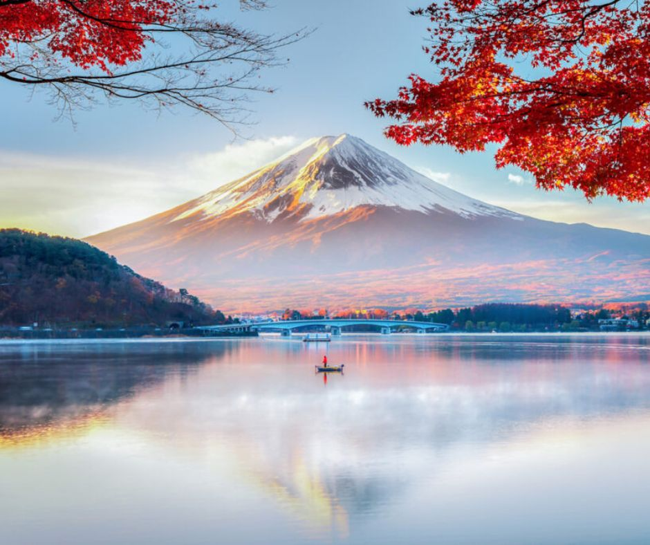
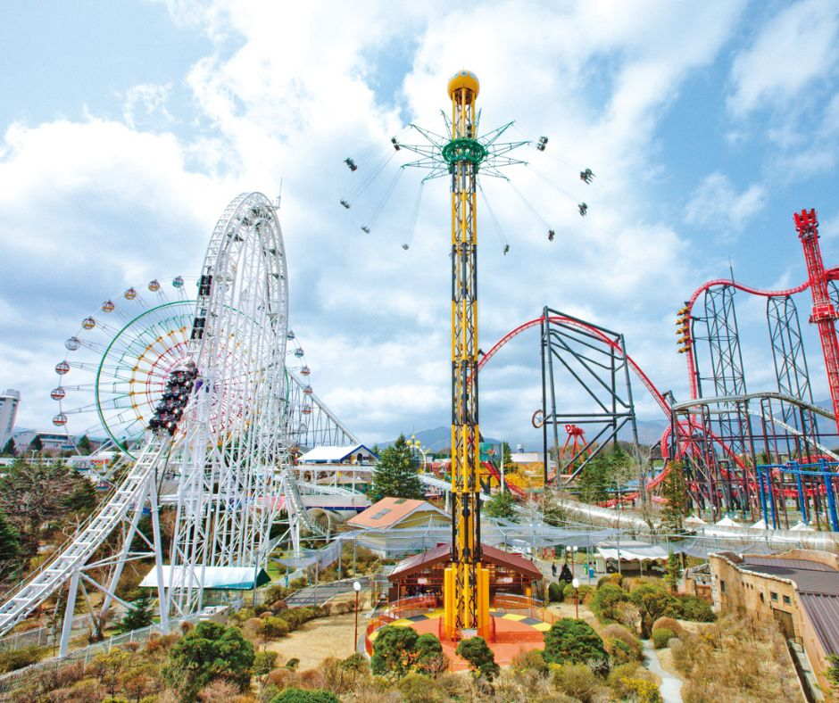

  
  
  

I was lucky enough to have visited Japan back in 2018, but I pretty much only stayed in the Tokyo area so there was a lot I hadn't gotten to explore. The prospect of a future trip to Japan is what motivates me to continue studying the language. While taking a Japanese class in Fall 2022, one of our projects was to pick a prefecture in Japan and do research to find out what that prefecture was famous for. A picture of Mount Fuji, taken at a popular tourist spot in the Yamanashi prefeture, caught my attention and so I decided to write about it for my project. 

## 山梨県  – リラクゼーションの県

富士山は観光客にもよく知られています。富士山を見たりしたいなら、山梨県に行くことをおすすめします。山梨は東京の西の方にあって、電車で１時間半ぐらいで行くことができます。天気は、だいたい涼しくていいです。雨が多いですが、よく降るので、きれいな滝があります。それに、きれいな温泉もあります。景色がとてもよくて、のんびりできる所です。ぜひ山梨に行ってみてください。

山梨県は、富士山が人気で、多くの人々が見に来るので、他におもしろい場所もたくさんあります。たとえば、富士山のとなりの「富士五湖」という所が人気になっています。富士五湖で、ハイキングをしたり、湖でパドルボードをしたり、キャンプをしたりすることができます。それに、にぎやかな所が好きだったら、「富士急ハイランド」が一番のおすすめです。ローラーコースターに乗ったり、アニメテーマの博物館を見たり、おばけやしの中を歩いたりすることができます。富士急ハイランドで乗れるローラーコースターは大きいし、速いし、楽しいと思います。たとえば、「ドドンパ」や「タカビシャ」や「ええじゃないか」というコースターがあります。コースターの中で、ドドンパが一番早いです。楽しい所ですから、行ってみてください。

山梨には、おいしい物もいっぱいあるので、新しい料理を食べるのが好きだったら、いい所だと思います。日本の中で、山梨にはワイナリーが一番多くあるので、ワインで有名です。ぶどうや桃やオレンジなど、色々な特別な味があります。大人はワインテイスティングをしている間、子どもはフルーツピッキングをすることができます。そして、山梨の料理が食べてみたいなら、おすすめは「ほうとう」というスープです。ほうとうに、めんとやさいとかぼちゃと肉が入っています。とてもおいしくて、ヘルシーそうです。ほうとうを食べた後で、「しげんもち」という有名なおかしを買うこともおすすめします。このもちには、きなことシロップをかけるともっとおいしくなると思います。あと、旅行の最後に、おみやげを買いたかったら、しげんもち味のキットカットを買うことができます。家族や友達にあげるとうれしくなるでしょう。

山梨は本当にいい所だと思います。リラックスをしたいなら、ぜひ行ってみてください。色々なおもしろいことができるから、だれも楽しむと思います。

*Rough English translation below:*

Mount Fuji is well known to tourists, but if you want to see Mount Fuji, I recommend going to Yamanashi prefecture. Yamanashi is located west of Tokyo and can be reached in about an hour and a half by train. The weather is usually cool and nice. Since it often rains a lot, there are beautiful waterfalls. In addition, there is a beautiful not spring. It is a place where scenery is very good and you can relax. You should definitely visit Yamanashi. 

While Yamanashi prefecture is famous for Mount Fuji and many people come to see it, there are many other interesting places. For example, next to Mount Fuji is a popular place called "Fujigoko" (Fuji Five Lakes). You can hike, paddleboard on the lakes, and camp there. Additionally, if you like lively places, "Fuji-Q Highland" is my top recommendation. You can ride roller coasters, visit an anime-themed museum, and walked though a haunted house. I think the roller coasters you can ride at Fuji-Q Highland are very big, fast, and fun. For example, there are coasters called Dodonpa, Takabisha, and Eejanaika. Dodonpa is the fastest among the coasters. It's a fun place, so I encourage you to visit.

Yamanashi has a lot of delicious food, so if you like trying new dishes, I think it's a great place. Throughout all of Japan, Yamanashi has the most wineries, so they're famous for their wine. There are various special flavors such as grape, peach, and orange. Kids can pick fruit while adults go wine tasting. And if you want to try Yamanashi cuisine, I recommend the "Hoto" soup. Hoto contians noodles, vegetables, pumpkin, and meat. It looks very tasty and healthy. After eating hoto, you can buy the famous "shigenmochi" snack. I hear that the mochi is even more delicious when you sprinkle kinako (soybean powder) and syrum on it. Also, if you want to buy some souvenirs at the end of your trip, you should get the shigenmochi flavored Kit Kats. Your family and friends will be delighted to recieve it. 

I think Yamanashi is a really nice place. If you are looking to relax, definitely try to visit. Since there are many interesting things to do, I think everyone will enjoy it. 

